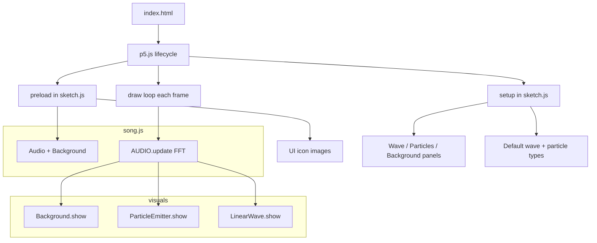

# Visualiser

A browser-based music visualiser built with [p5.js](https://p5js.org/) and [p5.sound](https://p5js.org/reference/#/libraries/p5.sound). It plays an MP3 track, analyses the audio in real time with an FFT, and drives layered visuals: a reactive background, particle effects, and waveform-based shapes.

There is no build step. Third-party libraries are installed into `vendor/` via npm (not committed to git). The app is plain HTML and JavaScript served from a local HTTP server (required so the browser can load audio and images).

## For new developers

Follow these steps in order the first time you open the project:

1. **Clone the repo** and `cd` into the project root.
2. **Install dependencies** — `npm install` copies p5.js, p5.sound, and QuickSettings into `vendor/` (see [Local dependencies](#local-dependencies)).
3. **Start a local HTTP server** (see [Run locally](#run-locally)). Do not double-click `index.html`; audio will not load over `file://`.
4. **Open the app** in a browser at `http://localhost:8000` (or the port your server prints).
5. **Trace the startup path** — `index.html` loads scripts → p5 calls `preload()` then `setup()` in `sketch.js` → `draw()` runs every frame.
6. **Try the controls** — click **Play** (or press Space), hide panels with **h**, tweak Wave / Particles / Background sliders.
7. **Make a small change** — edit a colour in `WAVE_CONFIG` (`wave.js`) or `PARTICLE_CONFIG` (`particleEmitter.js`), refresh the browser, and confirm the visual updates.

## Architecture



Each frame, audio analysis feeds all visual layers. The `Audio` class (`song.js`) wraps playback and FFT; visuals read `getWaveform()` and `getBassAmp()` but never touch the sound file directly.

## Quick start

### Prerequisites

- A modern web browser (Chrome, Firefox, Safari, or Edge)
- [Node.js](https://nodejs.org/) 18+ (to install vendor libraries and run tests)
- Any simple static file server (examples below)

### Local dependencies

After cloning, install libraries into `vendor/` (gitignored):

```bash
npm install
```

This runs `scripts/install-vendor.js` and copies **p5.js**, **p5.sound.js**, and **quicksettings.js** from npm. Control panels use `lib/controlPanels.js` (project code) instead of the former **p5.gui** wrapper.

### Run locally

From the project root:

```bash
npm install          # first time only
npm start            # serves on http://localhost:8000

# Or without npm scripts:
python3 -m http.server 8000
npx --yes serve .
```

Then open [http://localhost:8000](http://localhost:8000) (or the port your tool prints).

**Do not** open `index.html` directly as a `file://` URL. Browsers block or restrict loading audio that way; p5.sound expects files to be fetched over HTTP.

### First use

1. The canvas fills the window with control panels on the left (Wave, Particles, Background).
2. Click **Play** in the centre, or press **Space** or **p**, to start the track.
3. When playback starts, the GUIs hide automatically so the visualisation is full screen. Press **h** to show or hide the panels again.
4. Hover the **info** icon (bottom-left) to see music credits.

## Run locally

Requires `npm install` first so `vendor/` exists. Then:

```bash
npm start
# or: python3 -m http.server 8000
```

Then open [http://localhost:8000](http://localhost:8000).

## Test

```bash
npm install   # ensures vendor/ exists
npm test
```

- **`tests/configBinding.test.js`** — unit tests for GUI config binding helpers (`lib/configBinding.js`).
- **`tests/vendor.test.js`** — verifies vendor files are present after install.

Manual smoke test after changes: start the server, play audio, toggle panels, switch wave/particle types, resize the window.

## Deploy

This is a **static site** — deploy the project root as-is (no build step).

| Platform | Steps |
|----------|--------|
| **GitHub Pages** | Push to GitHub → Settings → Pages → deploy from `main` branch, root `/`. Site URL will be `https://<user>.github.io/<repo>/`. |
| **Netlify** | Drag the folder onto [app.netlify.com/drop](https://app.netlify.com/drop), or connect the repo with build command empty and publish directory `.`. |
| **Vercel** | Import the repo; framework preset **Other**; output directory `.`; no build command. |

Ensure `assets/` (MP3 and icons) is included in the deploy. External background image URLs must allow browser CORS from your host. Users must click **Play** once (browser autoplay policies block audio until interaction).

There is no `.github/workflows` or Dockerfile in this repo today — deployment is manual via a static host.

## Keyboard shortcuts

| Key | Action |
|-----|--------|
| `Space` or `p` | Play / pause (same as the Play button) |
| `h` | Toggle control panels |
| `r` | Reload the background image from the current URL in the Background panel |

## How it works

### High-level flow

Each frame, `draw()` in `sketch.js`:

1. Updates audio analysis (`AUDIO.update()`).
2. Translates the drawing origin to the centre of the canvas (all visuals are drawn relative to the middle).
3. Renders layers in order: **background** → **particles** → **wave**.
4. Optionally draws the info icon and credit text when the GUI is visible.

```
┌─────────────────────────────────────────────────────────┐
│  index.html  →  loads vendor/ libs + lib/ + app modules  │
└───────────────────────────┬─────────────────────────────┘
                            ▼
┌─────────────────────────────────────────────────────────┐
│  sketch.js     setup / draw / GUI / input / resize      │
└───┬─────────────┬─────────────────┬─────────────────────┘
    ▼             ▼                 ▼
 song.js      background.js    particleEmitter.js + wave.js
 (Audio)      (Background)     (ParticleEmitter, LinearWave)
    │             │                 │
    └─────────────┴─────────────────┘
                  │
            p5.FFT analyse / waveform / getEnergy
```

### Audio analysis (`song.js`)

The `Audio` class wraps a single `p5.SoundFile` and a `p5.FFT` analyser:

- **`analyze()`** — frequency spectrum (1024 bins, used indirectly via energy helpers).
- **`waveform()`** — time-domain waveform (−1 to 1), used to shape wave visuals.
- **`getEnergy(low, high)`** / **`getBassAmp()`** — amplitude in a frequency band; the background shake and many particles key off bass energy (90–200 Hz by default).

Default track and smoothing live in `SONG_PRESET`:

```javascript
playlist: [ /* track filenames under assets/ */ ],
url: 'Catmosphere - Candy-Coloured Sky.mp3',
fftSmooth: 0.3
```

Changing the playing file at runtime would mean calling `AUDIO.setSong('other-track.mp3')` (only loads when the URL changes). The GUI does not expose a track picker yet; only the default file is bundled in this repo.

### Background (`background.js`)

`Background` supports two modes (Background panel → **type**):

| Mode | Behaviour |
|------|-----------|
| **image** | Loads a URL (default: a Pexels photo), applies blur, draws it scaled with optional zoom, rotates slightly on strong bass, and overlays a semi-transparent black rectangle whose opacity follows bass level. |
| **solid** | Fills the canvas with a configurable RGB colour. |

Sliders control shake intensity, zoom, fade overlay, and fill colour. Press **r** to call `setImage()` again (useful after resizing the window so the image layout is refreshed).

### Waves (`wave.js`)

`LinearWave` maps the audio waveform to a polyline (or closed shape). The Wave panel uses a single **type** dropdown plus sub-settings; controls that do not apply to the current type are hidden.

| Type | Sub-settings | Description |
|------|--------------|-------------|
| **none** | — | Disables the wave layer. |
| **ring** | **style**: `open` \| `closed` | Open = two mirrored semicircles (stroke); closed = filled ring. Radius follows waveform + bass. |
| **line** | **direction**: `horizontal` \| `vertical`; **colourMode**: `solid` \| `rainbow` | Live waveform across width or height. Solid uses **stroke** colour; rainbow scrolls hue with volume. |

Line settings: **weight**, **distortion** (amplitude range), **offset** (centre position). Ring settings: **weight**, **stroke** (open) or **fill** (closed).

Ring geometry uses half a waveform (0–180°); line types sample the waveform across width or height.

### Particles (`particle.js`, `particleEmitter.js`)

`ParticleEmitter` spawns `Particle` instances each frame while audio is playing. Each particle has position, velocity, acceleration, size, colour, lifetime, and optional bass-responsive movement.

| Type | Spawn behaviour |
|------|-----------------|
| **ring** | Random point on a circle at `RING_CONFIG.radius` + bass; accelerates outward. |
| **sides** | From left or right edge; accelerates horizontally inward/outward. |
| **flames** | From bottom edge; accelerates upward. |
| **cascade** | From top edge; accelerates downward. |
| **starwars** | Near centre; random direction, high speed, white, long life, opacity increases over time. |
| **none** | Disables particles. |

Particles are removed when they leave the canvas bounds or exhaust their life. Playback can stop and existing particles still fade out.

### Main sketch (`sketch.js`)

- **`preload()`** — Creates `Audio` and `Background`, loads UI icons from `assets/`.
- **`setup()`** — Full-window canvas, three control panels (`lib/controlPanels.js` + QuickSettings), default wave and particle types, centred Play button.
- **`syncWave` / `setParticleEmitter`** — Wave and particle dropdown callbacks that instantiate the chosen visual module.
- **`toggleGui()`** — Shows or hides all QuickSettings panels.
- **`windowResized()`** — Resizes canvas, recentres Play button, refreshes background image sizing.

### Third-party libraries

Installed into `vendor/` via `npm install` (not committed):

| File | Role |
|------|------|
| `vendor/p5.js` | Canvas, drawing, vectors, images |
| `vendor/p5.sound.js` | `loadSound`, `FFT`, playback |
| `vendor/quicksettings.js` | Slider/dropdown UI widgets |

Project code replaces the former **p5.gui** wrapper:

| File | Role |
|------|------|
| `lib/controlPanels.js` | Creates QuickSettings panels for config objects |
| `lib/configBinding.js` | Maps config keys to widget types (unit tested) |

## Project layout

```
visualiser/
├── index.html              # Entry page and script load order
├── package.json            # npm deps + install/test scripts
├── scripts/
│   └── install-vendor.js   # Copies libs into vendor/ after npm install
├── lib/
│   ├── configBinding.js    # Config → widget binding helpers
│   └── controlPanels.js    # QuickSettings panel factory
├── tests/
│   ├── configBinding.test.js
│   └── vendor.test.js
├── sketch.js               # p5 setup/draw, GUI, keyboard, resize
├── song.js                 # Audio class and SONG_PRESET
├── background.js           # Background image/solid and BG_CONFIG
├── wave.js                 # LinearWave and WAVE_CONFIG
├── particle.js             # Particle physics and rendering
├── particleEmitter.js      # Emitter types and PARTICLE_CONFIG
├── vendor/                 # gitignored — created by npm install
│   ├── p5.js
│   ├── p5.sound.js
│   └── quicksettings.js
└── assets/
    ├── Catmosphere - Candy-Coloured Sky.mp3   # Default track
    └── icons8-info-30.png                     # Info / credits icon
```

## Customisation

### Change the default song

1. Add an MP3 under `assets/`.
2. Edit `SONG_PRESET.url` (and optionally `playlist`) in `song.js`.

The playlist in `song.js` lists several NCS/Argofox tracks; only **Catmosphere - Candy-Coloured Sky** is included in this repository. Other filenames will fail to load unless you add the files yourself.

### Change the background image

In the **Background** panel, set **url** to any image URL reachable by the browser (HTTPS hosts work when served locally). Toggle **fade**, **shake**, and **zoom** to taste.

### Tune bass reactivity

In `background.js`, adjust `BG_PRESET.bassFreqMin` / `bassFreqMax` and `shakeAmpMin`. Particle bass scaling uses `AUDIO.getBassAmp()` in `particle.js` (divisor `64` on velocity).

## Credits and licensing

- **Default music:** [Catmosphere – Candy-Coloured Sky](https://youtu.be/AZjYZ8Kjgs8) (Argofox). Shown in-app via the info control.
- **Icons:** [icons8.com](https://icons8.com) (info icon assets in `assets/`).
- **Libraries:** p5.js, p5.sound, and QuickSettings — see their respective projects for licenses.

## Known limitations / TODOs (from source)

- No editor vs viewer mode; GUIs are manual show/hide only.
- Bar-style spectrum visualisation exists only as commented code in `wave.js`.
- Additional playlist tracks referenced in `song.js` are not shipped in `assets/`.

## Troubleshooting

| Problem | Likely cause | Fix |
|---------|----------------|-----|
| No sound | Opened via `file://` | Use a local HTTP server (see Quick start) |
| Blank or frozen canvas | JavaScript error in console | Run `npm install`; check `vendor/` and `assets/` paths exist |
| Background image never appears | Invalid URL or CORS | Try another image URL; check browser network tab |
| Missing vendor scripts | Cloned without `npm install` | Run `npm install` from project root |
| Very slow first load | Large p5.js / MP3 download | Normal on first run; wait for preload to finish |

---

Author note in `sketch.js`: Peter Fitch — audio visualisation experiment.
